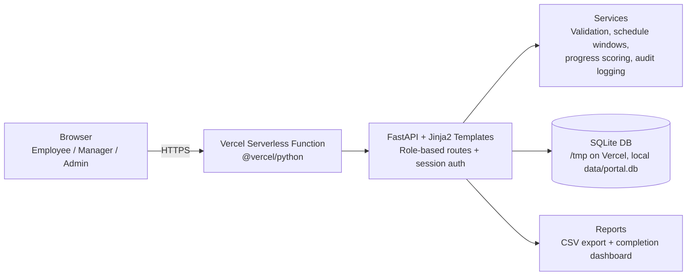

# AtomQuest Hackathon 1.0 — One‑Page Submission

## Working link (Live demo)

- Vercel URL: https://<your-vercel-project>.vercel.app

## Source code repository

- GitHub: https://github.com/Syu607/goals_portal

## Architecture diagram (high level)

## Summary (what’s delivered)

- A web-based Goal Setting & Tracking Portal supporting Employee, Manager (L1), and Admin/HR roles.
- Phase 1: goal creation + validations (max 8 goals, min 10% each, total 100%), submission, manager inline edits, approve & lock, return for rework, shared goals with synced achievements.
- Phase 2: quarterly achievement updates + status, computed progress scores by UoM formulas, manager check-in comments, schedule window enforcement.
- Governance: admin lock/unlock with audit trail; dashboards and CSV export report.
